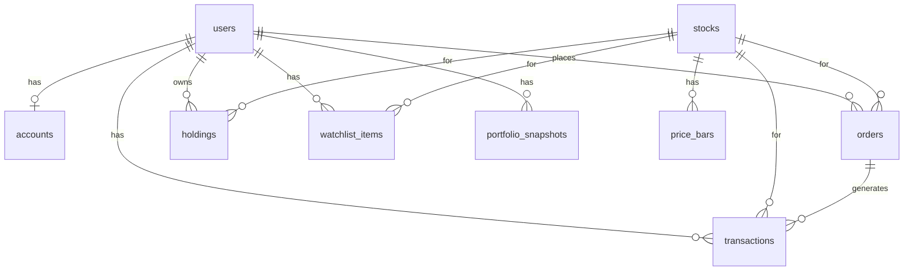

# ER Diagram (Mermaid)

```mermaid
erDiagram
  users ||--o| accounts : has
  users ||--o{ orders : places
  users ||--o{ holdings : owns
  users ||--o{ transactions : has
  users ||--o{ watchlist_items : has
  users ||--o{ portfolio_snapshots : has
  stocks ||--o{ price_bars : has
  stocks ||--o{ orders : for
  stocks ||--o{ holdings : for
  stocks ||--o{ transactions : for
  stocks ||--o{ watchlist_items : for
  orders ||--o{ transactions : generates
```
